  

  <b>Software Engineer | Full-Stack Developer</b>

 

# Berk Topal

### Software Engineer | Full-Stack Developer

Software Engineer with hands-on experience in full-stack software development, specializing in building scalable applications with modern ecosystems like Java, Spring Boot, React, and Node.js. Skilled in designing robust backend architectures, integrating secure RESTful APIs, and managing seamless data workflows.

---

### Technical Ecosystem

* **Languages:** JavaScript, Python, Java, C#
* **Frontend:** React, HTML, CSS, Tailwind
* **Backend:** .NET, Node.js, Express.js, Spring Boot
* **Databases:** PostgreSQL, MongoDB, MySQL
* **Tools & Methodologies:** Git, Postman, Axios, Agile, Scrum

---

### Projects

* **Berq Bank (Java Full-Stack / P2P Transfer):** Built a Spring Boot P2P application handling concurrent transaction requests using PostgreSQL. Successfully resolved async race conditions and integrated Chart.js for data analytics.
* **Quiz Web Application (MERN Stack):** Built a REST API with MongoDB integration, complete with a custom scoring system and leaderboard functionality.
* **SMART Sales Manager:** Collaborative Java-based project focused on optimizing sales management processes.

> **Note:** The Inventory Tracking System developed during my internship is closed-source due to company policies.
