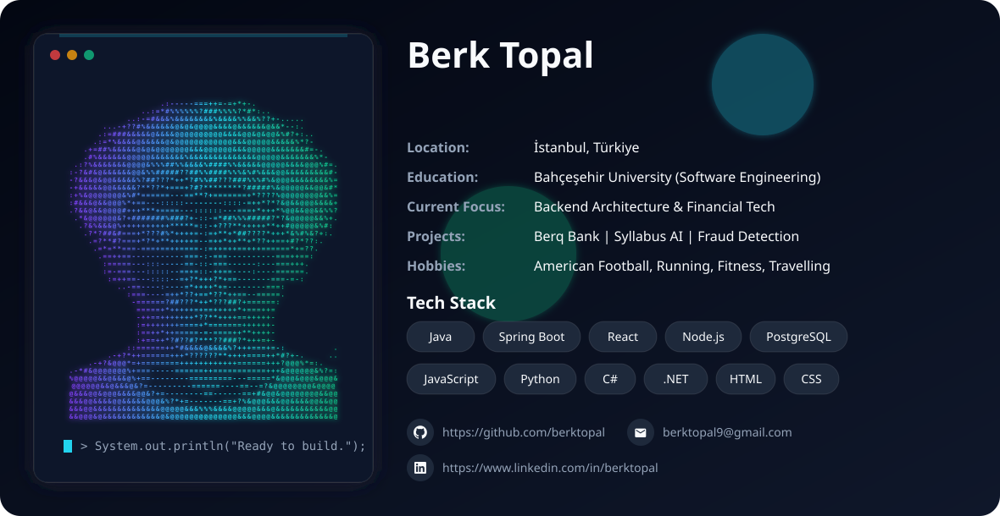

  <picture>
    
  </picture>

## Hi, I'm Berk 👋

Software engineer (B.S. Software Engineering, Bahçeşehir University) focused on **full-stack development with Java / Spring Boot, React and Node.js**. I'm especially interested in **financial systems** — transfers, credit decisions and fraud detection — where correctness and security come first.

## Tech Stack

**Backend:** Java · Spring Boot · Spring Security · JPA / Hibernate · Node.js · Express  
**Frontend & Mobile:** React · React Native (Expo) · TypeScript · Flutter · Material UI  
**Data:** PostgreSQL · MySQL · MongoDB · SQLite  
**Tooling:** Git · GitHub Actions · Maven · JUnit · Jest · Selenium  
**AI:** RAG pipelines, local LLMs (Microsoft Foundry Local)

## Featured Projects

| Project | What it is | Stack |
|---|---|---|
| [**berq_bank_p2p**](https://github.com/berktopal/berq_bank_p2p) | P2P money transfers with ownership checks, row-level locking against double spending and BCrypt | Spring Boot · PostgreSQL |
| [**loan-system**](https://github.com/berktopal/loan-system) | Loan decision support: rule-based credit decisions, JWT auth, audit trail, end-to-end API tests | Spring Boot · React · PostgreSQL |
| [**fraud-project**](https://github.com/berktopal/fraud-project) | Rule-based fraud detection for transfers with an analyst review dashboard | Spring Boot · React · PostgreSQL |
| [**fateful-moment**](https://github.com/berktopal/fateful-moment) | Timed decision simulation for iOS & Android, implemented from a Figma design system, Jest-tested | React Native · Expo · TypeScript |
| [**microsoft-foundry-local-rag**](https://github.com/berktopal/microsoft-foundry-local-rag) | Fully offline, privacy-first document Q&A assistant | Python · Foundry Local · SQLite |
| [**expense_tracker**](https://github.com/berktopal/expense_tracker) | Expense tracking with JWT auth, analytics and budget tracking | React · Express · MySQL |

## How I Work

- Automated tests and CI (GitHub Actions) on my main projects
- Security by default: no secrets in code, input validation, ownership checks
- Clear documentation: every project explains its architecture, setup and trade-offs
